<div align="center">

```text
┌─────────────────────────────────────────────────────────────┐
│  ks1686@github ~                                            │
│  $ whoami                                                   │
│  Karim Smires                                               │
│  builder · systems · open source                            │
└─────────────────────────────────────────────────────────────┘
```

**M.S. Machine Learning @ Rutgers** · building cross-platform tools, trading TUIs, and IoT systems

[Portfolio](https://ks1686.github.io/) · [LinkedIn](https://www.linkedin.com/in/karim-smires/) · [Email](mailto:k.smires101@icloud.com)

<br/>

<a href="https://github.com/ks1686">
  <picture>
    <source media="(prefers-color-scheme: dark)" srcset="./profile/stats-dark.svg" />
    <source media="(prefers-color-scheme: light)" srcset="./profile/stats.svg" />
    
  </picture>
</a>
<a href="https://github.com/ks1686">
  <picture>
    <source media="(prefers-color-scheme: dark)" srcset="./profile/top-langs-dark.svg" />
    <source media="(prefers-color-scheme: light)" srcset="./profile/top-langs.svg" />
    
  </picture>
</a>

</div>

---

## Featured projects

### [genv](https://github.com/ks1686/genv) — Global Environment Manager
Cross-platform package & environment sync for Linux, macOS, and Windows. One declarative `genv.json`, many package managers — `brew`, `pacman`, `apt`, `dnf`, `apk`, `winget`, `uv`, `cargo`, and more.

```bash
brew tap ks1686/tap && brew install --cask genv
genv scan && genv apply
```

[Docs](https://pea-pod.me/genv/) · [Homebrew tap](https://github.com/ks1686/homebrew-tap) · **Go**

### [public-terminal](https://github.com/ks1686/public-terminal) — Trading TUI for Public.com
A btop-style portfolio terminal: live multi-account streaming, options close, and market-cap-weighted direct index investing with automated daily rebalancing (systemd or launchd).

```bash
go install github.com/ks1686/public-terminal/cmd/public-terminal@latest
```

**Go** · Bubble Tea · Lipgloss

### [DrinkSync](https://github.com/ks1686/DrinkSync) — Sustainable hydration tracking
Low-cost IoT smart coaster + Kotlin Android app with BLE streaming, Room persistence, and gamified goals. Co-authored [IEEE publication](https://ieeexplore.ieee.org/document/11449671).

**Kotlin** · Arduino · BLE · IEEE

### [pea-pod](https://github.com/ks1686/pea-pod) — Personal project hub
Vanilla JS / PWA homepage for the public tools, served on Cloudflare Workers + GitHub Pages.

[pea-pod.me](https://pea-pod.me/) · **JavaScript** · Cloudflare

### [psych-cert-automator](https://github.com/ks1686/psych-cert-automator) — CE certificate desktop app
Matches Zoom attendance to Qualtrics surveys and prints GSAPP CE PDFs. Tauri + Python, offline installers for macOS / Windows / Linux.

**Python** · Tauri · Bun

### [AI-Enabled-Payment-Kiosk](https://github.com/ks1686/AI-Enabled-Payment-Kiosk) — LLM kiosk checkout
JSON menu, cart, Llama chatbot (text + voice), and crypto / card payments.

**Node.js** · Express · LLM

---

## Stack

**Languages** — Python · TypeScript / JavaScript · Go · Java · Kotlin · C / C++ · C# · Swift · Rust · SQL · MATLAB · Verilog

**Cloud & infra** — AWS · Docker · GitHub Actions · Cloudflare

**AI / ML** — PyTorch · TensorFlow · Hugging Face · OpenCV · CUDA · LLMs · NLP · computer vision · RL

<p align="center">
  
  
  
  
  
  
  
  
</p>

---

## Contribution snake

<div align="center">
  <picture>
    <source media="(prefers-color-scheme: dark)" srcset="https://raw.githubusercontent.com/ks1686/ks1686/output/github-snake-dark.svg" />
    <source media="(prefers-color-scheme: light)" srcset="https://raw.githubusercontent.com/ks1686/ks1686/output/github-snake.svg" />
    
  </picture>
</div>

---

<div align="center">

`cat contact.txt`

**k.smires101@icloud.com** · [linkedin.com/in/karim-smires](https://www.linkedin.com/in/karim-smires/) · [ks1686.github.io](https://ks1686.github.io/)

</div>
